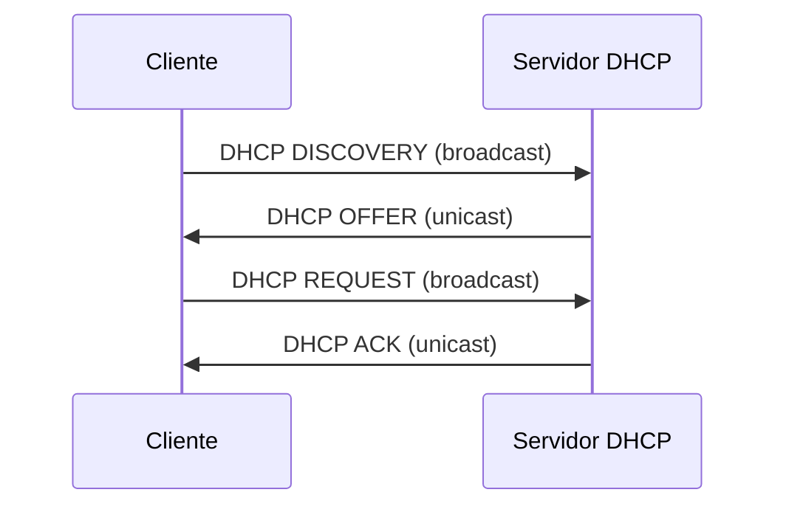

# UNIDAD 1: SERVICIO DHCP


---

## 1. Introducción

- Ya sabemos que la única forma de identificar un equipo en una red de forma unívoca es mediante su dirección IP.
- Por tanto, el administrador de red de una empresa se ve obligado a configurar las IPs de cada uno de los equipos de la red, ya sean ordenadores, servidores, impresoras, etc. Cuando el número de dispositivos es importante, esta tarea puede convertirse en algo repetitivo, tedioso y poco manejable.
- En este punto entra en juego el servicio **DHCP** (*Dynamic Host Configuration Protocol*), que permite la configuración de forma dinámica y automática de direcciones IP, máscaras de subred, gateways o puertas de enlace y otras opciones.

---

## 2. Ventajas del uso de DHCP

El uso de DHCP tiene diversas ventajas que se enumeran a continuación:

- **Centraliza la administración:** sólo es necesario editar un único archivo, el de configuración del servidor.
- **Evita errores y conflictos IP:** no se asignan IPs duplicadas o erróneas.
- **Ahorra tiempo:** al sólo tener que editar un archivo en el servidor, no es necesario configurar nada en los equipos que reciben la IP.

---

## 3. Funcionamiento

- En una red suele haber un servidor configurado para ofrecer IPs a los equipos que las necesiten. Si un equipo está configurado con una IP estática, no hará falta el uso de los servicios del servidor DHCP.
- Para el servicio DHCP, necesitaremos configurar:
  - **Servidor:** para asignar los parámetros a los clientes que las necesiten.
  - **Clientes:** para que reciban los parámetros mediante DHCP.
- Los parámetros más comunes que un servidor DHCP puede asignar a un cliente son:
  - Dirección IP y máscara de red
  - DNS
  - Puerta de enlace o gateway

### Proceso de asignación (DORA)

1. El cliente solicita una configuración de red (**DHCP DISCOVERY**).
2. El servidor comprueba las IPs que hay disponibles en ese momento (las que todavía no ha asignado), dentro del rango de IPs que tiene para conceder y ofrece una al cliente (**DHCP OFFER**).
3. Si el cliente acepta, envía una solicitud al servidor para quedarse con la IP (**DHCP REQUEST**).
4. Si el servidor comprueba que está todo correcto, acepta la petición del cliente y le confirma que puede utilizar esa IP. La concederá por un periodo de tiempo determinado (**DHCP ACK**).


*Figura 1: Funcionamiento de mensajes DHCP Server-Client.*

### Tipos de mensaje

**DHCP DISCOVERY**
- Es un mensaje de broadcast que envía el cliente, ya que cuando un cliente se conecta a la red no conoce nada de ella, por lo que no conocerá quien es el servidor DHCP. Envía un mensaje multidifusión para que lo conteste quien corresponda, en este caso el servidor DHCP.

**DHCP OFFER**
- El servidor DHCP contestará al mensaje de broadcast del cliente (DHCPDISCOVERY) con la oferta de los parámetros de configuración.

**DHCP REQUEST**
- El cliente puede aceptar o rechazar la oferta del servidor. Si la rechaza, enviará un nuevo mensaje "DHCP Discovery", de tal manera que el servidor se dará por enterado de que debe realizar una nueva oferta.
- Si el cliente acepta, envía el mensaje de broadcast "DHCP Request" porque además del servidor, los demás equipos también sabrán la dirección que se va a utilizar.

**DHCP ACKNOWLEDGE (ack/nack)**
- **ACK:** Mensaje del servidor al cliente con los parámetros de configuración. Tras el mensaje, anotará la información en sus registros.
- **NACK:** Mensaje del servidor al cliente indicando que la dirección IP que solicita no es válida para la subred en la que se encuentra o ya no la puede asignar porque la tiene otro equipo.

**DHCP RELEASE**
- El cliente puede indicarle al servidor DHCP que libera la dirección IP asignada y termina con el contrato establecido.

---

## 4. Archivo de configuración

- Se trata de un archivo de texto, llamado `dhcpd.conf`, que recoge una serie de entradas para configurar el servidor DHCP. Este archivo lo podemos encontrar en el directorio `/etc/dhcp`.
- Las entradas se clasifican en:
  - **Declaraciones:** describen redes, máquinas o grupos de máquinas junto con un rango de direcciones IP.
  - **Parámetros:** describen el comportamiento del servidor DHCP. Pueden ser parámetros globales o locales a un conjunto de declaraciones.
- La estructura general del archivo `dhcpd.conf` es la siguiente:

```
Parámetros globales;

Declaración_1 {
  (Parámetros locales relativos a Declaración_1)
}

...

Declaración_N {
  (Parámetros locales relativos a Declaración_N)
}
```

### Ejemplo completo

```
subnet 192.168.1.0 netmask 255.255.255.0 {

  range 192.168.1.11 192.168.1.29;

  option domain-name-servers 192.168.1.1, 193.146.96.2, 193.146.96.3;
  option domain-name "uimagen.iaf";
  option routers 192.168.1.1;
  option subnet-mask 255.255.255.0;
  option broadcast-address 192.168.1.255;

  default-lease-time 86400;
  max-lease-time 172800;

  group {

    default-lease-time 604800;
    max-lease-time 691200;

    host apache {
        hardware ethernet 00:10:5a:f1:35:87;
        fixed-address 192.168.1.3;
    }

  }
}
```

!!! tip "Cómo leer estos ejemplos"
    En cada bloque de código, la **línea resaltada** es la que corresponde al elemento que se está explicando. El resto del bloque es solo el contexto (dónde iría colocada dentro del archivo).

### 4.1 Declaraciones

#### `GROUP`

Se utiliza para aplicar una serie de parámetros y declaraciones a un conjunto de máquinas, subredes e incluso otros grupos.

**Sintaxis:**
```conf
group etiqueta {
  [parámetros]
  [declaraciones]
}
```

**Ejemplo:**
```conf
group grupo1 {
  option routers 192.168.110.1;
  option subnet-mask 255.255.255.0;
  host pc03 {
    ...
  }
}
```

#### `HOST`

Se utiliza para aplicar parámetros y declaraciones a una máquina en particular.

**Sintaxis:**
```conf
host etiqueta_equipo {
  [parámetros]
  [declaraciones]
}
```

**Ejemplo:**
```conf
host pc02 {
  option host-name "pc2.aulaSER";
  hardware ethernet 00:50:b3:c5:60:23;
  fixed-address 192.168.100.12;
}
```

#### `SUBNET`

Indica una subred, señalando la IP de la misma junto con su máscara de red.

**Sintaxis:**
```conf
subnet IP_subred netmask mascara_subred {
  [parámetros]
  [declaraciones]
}
```

**Ejemplo:**
```conf
subnet 192.168.100.0 netmask 255.255.255.0 {
  range 192.168.100.101 192.168.100.109;
  range 192.168.100.191 192.168.100.198;
}
```

### 4.2 Parámetros

#### `fixed-address`

Solo aparece dentro de la declaración `host` y se utiliza para asignar direcciones IP fijas con reserva.

**Sintaxis:** `fixed-address <dir_IP>;`

**Ejemplo:**
```conf hl_lines="4"
subnet 140.220.191.0 netmask 255.255.255.0 {
  host iesserver {
    hardware ethernet 08:00:2b:4c:59:23;
    fixed-address 140.220.191.1;
  }
}
```

#### `hardware`

Se utiliza para identificar una máquina concreta. Se debe especificar la dirección física (MAC) de la interfaz de red. En `<tipo>` se indica el tipo de interfaz de red: `ethernet` o `token-ring`.

**Sintaxis:** `hardware <tipo> direccion_hardware;`

**Ejemplo:**
```conf hl_lines="3"
subnet 140.220.191.0 netmask 255.255.255.0 {
  host iesserver {
    hardware ethernet 08:00:2b:4c:59:23;
    fixed-address 140.220.191.1;
  }
}
```

#### `host-name`

Nombre que se asignará al host solicitado.

**Sintaxis:** `host-name <nombre_equipo>;`

**Ejemplo:**
```conf hl_lines="2"
host pc02 {
  option host-name "pc2.aulaSER";
  hardware ethernet 00:50:b3:c5:60:23;
  fixed-address 192.168.100.12;
}
```

#### `range`

Indica un rango de direcciones válidas que se asignarán a los clientes.

**Sintaxis:** `range IP_inicial IP_final;`

**Ejemplo:**
```conf hl_lines="2"
subnet 140.220.191.0 netmask 255.255.255.0 {
  range 140.220.191.150 140.220.191.249;
}
```

#### `option routers`

Se usa para enviarle al cliente la puerta de enlace. Se puede enviar una IP o un nombre.

**Sintaxis:** `option routers <listaIPs>;`

**Ejemplo:**
```conf hl_lines="3"
subnet 10.0.0.0 netmask 255.255.255.0 {
  range 10.0.0.10 10.0.0.254;
  option routers 10.0.0.1;
}
```

#### `option subnet-mask`

Se usa para especificar la máscara de subred que se enviará al cliente. Si se omite esta opción, se configurará la máscara que va asociada a la declaración de la subred.

**Sintaxis:** `option subnet-mask <mascara>;`

**Ejemplo:**
```conf hl_lines="5"
subnet 10.0.0.0 netmask 255.255.255.0 {
  range 10.0.0.10 10.0.0.254;
  option routers 10.0.0.1;
  option broadcast-address 10.0.0.255;
  option subnet-mask 255.255.255.0;
}
```

#### `option domain-name-servers`

Se utiliza para enviar a los clientes el/los servidor/es DNS que utilizarán. Si se ponen varias direcciones, deben ir en orden de preferencia: primero el servidor primario, después el secundario, etc.

**Sintaxis:** `option domain-name-servers <IPs>;`

**Ejemplo:**
```conf hl_lines="3"
subnet 10.0.0.0 netmask 255.255.255.0 {
  range 10.0.0.10 10.0.0.254;
  option domain-name-servers 8.8.8.8, 8.8.4.4;
}
```

---

## 5. Intervalos, exclusiones, concesiones y reservas

**Intervalos**
Los intervalos son los rangos de IPs dinámicas que un servidor DHCP tiene disponible para asignar a los clientes. Si un servidor atiende a distintas redes, tendrá intervalos para cada una de ellas, como vemos en el ejemplo de abajo:

```
subnet 140.220.191.0 netmask 255.255.255.0 {
    range 140.220.191.150 140.220.191.249;
}

subnet 239.252.197.0 netmask 255.255.255.0 {
    range 239.252.197.10 239.252.197.107;
    range 239.252.197.113 239.252.197.250;
}
```

**Exclusiones**
Son aquellas direcciones IP que no se ofrecen dinámicamente por el servidor, es decir, no forman parte de ningún intervalo. En el ejemplo anterior serían de la 239.252.197.108 a la 239.252.197.112.

**Concesiones**
- La asignación de una dirección IP y del resto de parámetros de red por parte del servidor es lo que se conoce como concesión.
- Las concesiones se realizan por un periodo de tiempo determinado. Una vez se agota este periodo de tiempo la concesión se puede renegociar para ampliarla o cancelarla.
- Tanto el servidor como el cliente registran la concesión realizada y si se decide ampliarla, se intenta que esta concesión sea la misma.

**Reservas**
- Llamamos reservas a aquellas IPs que se asignan mediante DHCP pero de forma fija, es decir, al mismo dispositivo se le asigna siempre la misma IP.
- En el ejemplo de abajo, al host "iesserver" se le asigna siempre la misma IP. Este host queda identificado gracias a su dirección física o MAC.
- De esta forma vemos que cuando iesserver esté activo, recibirá esta IP. No obstante, cuando esté apagado o no esté en la red, esta IP no se le asignará a nadie.

```
subnet 140.220.191.0 netmask 255.255.255.0 {
    host iesserver{
        hardware ethernet 08:00:2b:4c:59:23;
        fixed-address 140.220.191.1;
    }
    range 140.220.191.150 140.220.191.249;
}
```

---

## 6. Problemas DHCP

- **DOS o denegación de servicio:** si un servidor DHCP es inundado con un gran número de peticiones simultáneamente, puede llegar a saturarse y bloquear su funcionamiento.
- **DHCP Spoofing:** se produce cuando la petición de broadcast del cliente para solicitar una IP es atendida por un servidor malicioso de un atacante.
- No pueden existir dos dispositivos con la misma IP en una red en ningún caso. Puede darse este conflicto por diversas razones:
  - Una mala configuración del archivo DHCP a causa de un error humano.
  - Cuando un cliente configura una IP de forma estática en su equipo, poniéndose una IP que está dentro del rango que el servidor DHCP puede asignar.
