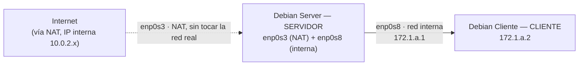

# UD01: Práctica DHCP 1

!!! abstract "Objetivo de la práctica"
    Configurar un servidor DHCP en **Debian sin interfaz gráfica** (VirtualBox) que reparta dirección IP, puerta de enlace y DNS a un cliente **Debian con interfaz gráfica** conectado por red interna.

    **Materiales:** VirtualBox · Debian Server (sin entorno gráfico) · Debian Cliente (con entorno gráfico) · `isc-dhcp-server`

!!! warning "Toda la práctica se hace en local, sin tocar la red del centro"
    La red del instituto la gestiona Consellería y tiene un número limitado de IPs. Si conectas el adaptador de una máquina virtual en modo **Adaptador puente**, la VM pide una IP real a esa red como si fuera un dispositivo más — y el centro se queda sin IPs disponibles.

    Por eso, en esta práctica el único adaptador que sale a Internet va en modo **NAT** (VirtualBox le asigna una IP interna propia, típicamente `10.0.2.x`, y hace de traductor de direcciones — no se pide nada a la red real). El resto de la topología es exactamente igual: una red interna entre servidor y cliente, sin salir del propio equipo.

---

## 1. Piensa la estructura de red virtual

Antes de empezar, es necesario tener clara la topología: dos máquinas virtuales en tu propio ordenador, conectadas entre sí, donde solo el servidor tiene salida a Internet (para poder instalar paquetes) sin llegar a formar parte de la red real del centro:

- **Máquina virtual 1 – Debian Server** (SERVIDOR/Router, **sin interfaz gráfica**): con dos tarjetas de red, una en modo NAT (solo para salida a Internet, `10.0.2.x`) y otra hacia la red interna con la máquina cliente (`172.1.a.1`).
- **Máquina virtual 2 – Debian Cliente** (CLIENTE, **con interfaz gráfica**): conectada únicamente a la red interna (`172.1.a.2`).


*Figura 1: Topología de la red virtual — servidor con salida NAT (no bridge) y cliente por red interna, todo local.*


*Captura: diagrama o resultado de tu propia topología de red virtual.*

---

## 2. Configura las tarjetas de red virtuales

En VirtualBox, configura las tarjetas de red de la máquina servidor:

- **Adaptador 1:** conectado en modo **NAT** (no en modo puente), únicamente para tener salida a Internet y poder instalar paquetes con `apt`.
- **Adaptador 2:** conectado en modo *Red interna*, para comunicarse con la máquina cliente.

!!! danger "No uses Adaptador puente"
    Si conectas el Adaptador 1 en modo *Adaptador puente*, tu máquina virtual pedirá una IP a la red real del centro (gestionada por Consellería), consumiendo un recurso limitado. Usa siempre **NAT** para la salida a Internet en esta práctica.


*Captura: pantalla de Configuración > Red de la máquina virtual, con el Adaptador 1 en NAT y el Adaptador 2 en Red interna.*

---

## 3. Identifica las interfaces de red

Desde la máquina servidor, ejecuta el siguiente comando para listar las interfaces de red disponibles:

```bash
ip a
```

Identifica el nombre de cada interfaz (por ejemplo, `enp0s3` y `enp0s8`) y anota cuál corresponde a la salida NAT y cuál a la red interna con el cliente.


*Captura: terminal con el resultado del comando `ip a`, señalando las interfaces relevantes.*

---

## 4. Configura las redes

En la ruta `/etc/network` encontramos el archivo de interfaces de red y podemos configurarlo. Un ejemplo sería el siguiente:

```text title="/etc/network/interfaces"
# This file describes the network interfaces available on your system
# and how to activate them. For more information, see interfaces(5).

source /etc/network/interfaces.d/*

# The loopback network interface
auto lo enp0s3 enp0s8
iface lo inet loopback

# The primary network interface (salida NAT, no la red del centro)
allow-hotplug enp0s3
iface enp0s3 inet dhcp

iface enp0s8 inet static
        address 172.1.2.1
        netmask 255.255.255.0
```

!!! tip "Recuerda"
    Cada cambio en la red necesita reinicio: `sudo systemctl restart networking`.


*Captura: editor `nano` (o el que uses) mostrando tu archivo de configuración de red ya editado.*

---

## 5. Configura el servidor DHCP

1. Instala el servidor DHCP llamado `isc-dhcp-server` en tu servidor.
2. Configura la interfaz en el archivo del servidor DHCP que se encuentra en `/etc/default`. Debe ser la interfaz de la **red interna** (`enp0s8`), nunca la de salida NAT.
3. Configura el archivo de configuración que se encuentra en `/etc/dhcp`, teniendo en cuenta los ejemplos vistos en teoría (PDF del tema 2).

!!! warning "Parámetros obligatorios del `subnet`"
    - **Rango:** desde la IP `.3` hasta la `.10` de la interfaz correspondiente. Es decir, `X.X.X.3` a `X.X.X.10` (siendo `X.X.X.0` la red de la interfaz donde está el DHCP).
    - **Puerta de enlace:** debes enviarla a los clientes a los que asignes IP.
    - **DNS:** debes enviar dos, `1.1.1.1` y `8.8.8.8`.

### 5.1 Instalación del servidor DHCP

```bash
sudo apt update
sudo apt install isc-dhcp-server
```


*Captura: terminal con la instalación del paquete completada sin errores.*

### 5.2 Configuración de la interfaz (`/etc/default/isc-dhcp-server`)


*Captura: editor mostrando la interfaz configurada (por ejemplo, `INTERFACESv4="enp0s8"`).*

### 5.3 Configuración del archivo `/etc/dhcp/dhcpd.conf`


*Captura: editor mostrando el bloque `subnet` con el `range`, `option routers` y `option domain-name-servers` configurados.*

---

## 6. Hagamos la prueba

Último paso: comprueba que todo funciona según lo diseñado.

- Reinicia el servicio DHCP: `sudo systemctl restart isc-dhcp-server`.
- Desde la máquina cliente (Debian con interfaz gráfica), renueva o solicita la IP por DHCP y comprueba que recibe una dirección dentro del rango configurado, la puerta de enlace y los DNS indicados.


*Captura: `sudo systemctl status isc-dhcp-server` mostrando el servicio activo (`active (running)`).*


*Captura: en la máquina cliente, resultado de `ip a` (o `ipconfig`/equivalente) mostrando la IP, puerta de enlace y DNS recibidos por DHCP.*

### Checklist de verificación

- [ ] El Adaptador 1 del servidor está en modo **NAT**, no en modo puente.
- [ ] El cliente recibe una IP dentro del rango `X.X.X.3` – `X.X.X.10`.
- [ ] La puerta de enlace recibida coincide con la IP de `enp0s8` del servidor.
- [ ] Los DNS recibidos son `1.1.1.1` y `8.8.8.8`.
- [ ] `systemctl status isc-dhcp-server` muestra `active (running)` sin errores.

---

## 7. Comprobando tu dominio del servicio

Ya tienes el servidor funcionando. En este bloque lo vas a modificar en caliente, pararlo y arrancarlo, y vas a comprobar que entiendes **qué hay que reiniciar en cada caso** (servidor, cliente, o ambos) y por qué.

!!! note "Antes de empezar, recuerda estos comandos"
    ```bash
    systemctl restart isc-dhcp-server   # aplica cambios en el SERVIDOR
    systemctl status isc-dhcp-server    # consulta el estado del servicio
    ```

    Para que el **cliente** pida una IP nueva, el comando depende de cómo gestione la red:

    ```bash
    # Si el cliente usa ifupdown (como el servidor):
    sudo systemctl restart networking

    # Si el cliente usa NetworkManager (habitual en una Debian con entorno gráfico):
    sudo dhclient -r && sudo dhclient
    ```

    !!! warning "El cliente con interfaz gráfica suele usar NetworkManager, no ifupdown"
        Una instalación de Debian con entorno de escritorio suele traer **NetworkManager** activo por defecto, a diferencia del servidor (sin interfaz gráfica), que usa el `ifupdown` clásico (`/etc/network/interfaces`). Si `systemctl restart networking` no hace nada en el cliente, usa `sudo dhclient -r && sudo dhclient` para liberar y renovar la IP manualmente, o desconecta y reconecta el adaptador desde el icono de red del escritorio.

### 7.1 Reduce el rango de IPs

1. Cambia el `range` de tu subred a un rango más pequeño y distinto del que ya usabas: `X.X.X.20` – `X.X.X.30`.
2. Reinicia el **servidor** para aplicar el cambio:
   ```bash
   sudo systemctl restart isc-dhcp-server
   ```
3. Desde el **cliente**, solicita una IP nueva (con el comando que corresponda según arriba).
4. Comprueba el resultado:
   ```bash
   systemctl status isc-dhcp-server
   ```

### 7.2 Comprobación de detención e inicio del servicio

1. En el **cliente**, solicita una IP nueva.
2. En el **servidor**, comprueba que se han completado los 4 pasos del proceso DORA (Discovery → Offer → Request → Ack).
3. Detén el servicio en el servidor:
   ```bash
   sudo systemctl stop isc-dhcp-server
   ```
4. Repite los pasos 1 y 2.

    !!! question "Reflexiona"
        - ¿Ha pasado lo mismo que antes?
        - ¿Tiene IP el cliente?
        - ¿Por qué?

5. Vuelve a iniciar el servicio DHCP:
   ```bash
   sudo systemctl start isc-dhcp-server
   ```
6. Repite los pasos 1 y 2 de nuevo.

    !!! question "Reflexiona"
        ¿Vuelve todo a la normalidad? ¿Por qué crees que se comporta así?

### 7.3 IP fija (reserva) para un dispositivo

1. Manteniendo el rango anterior (`X.X.X.20` – `X.X.X.30`), añade una **IP fija** (`fixed-address`) para el cliente, fuera de ese rango: `X.X.X.50`.

    ??? tip "Pista, si no recuerdas la sintaxis"
        Repasa la sección **4.1 Declaraciones → `HOST`** y **4.2 Parámetros → `fixed-address`** de la UD1. Necesitas una declaración `host` dentro de tu `subnet`, identificando el equipo por su MAC (`hardware ethernet`) y asignándole la IP fija (`fixed-address`).

2. Comprueba que funciona correctamente:
   - Captura la asignación en el estado del servidor (`systemctl status isc-dhcp-server`).
   - Captura la configuración de la subred en el `dhcpd.conf`.

#### ✅ Qué debes entregar de este apartado

- [ ] Captura del `dhcpd.conf` con el rango cambiado a `X.X.X.20`–`X.X.X.30`.
- [ ] Respuesta razonada a las preguntas de reflexión del apartado 7.2.
- [ ] Captura del `dhcpd.conf` con la reserva de IP fija (`X.X.X.50`).
- [ ] Captura de `systemctl status isc-dhcp-server` mostrando esa IP ya asignada al cliente.

---

## ¿Alguna duda?

Si el cliente no recibe IP, revisa primero el `subnet` del paso 5: rango, `option routers` y `option domain-name-servers`. Si además el problema es de conectividad general, revisa que el Adaptador 1 esté en modo **NAT** y no en modo puente.
