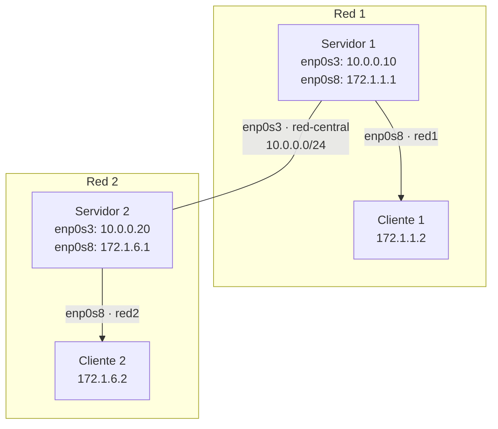
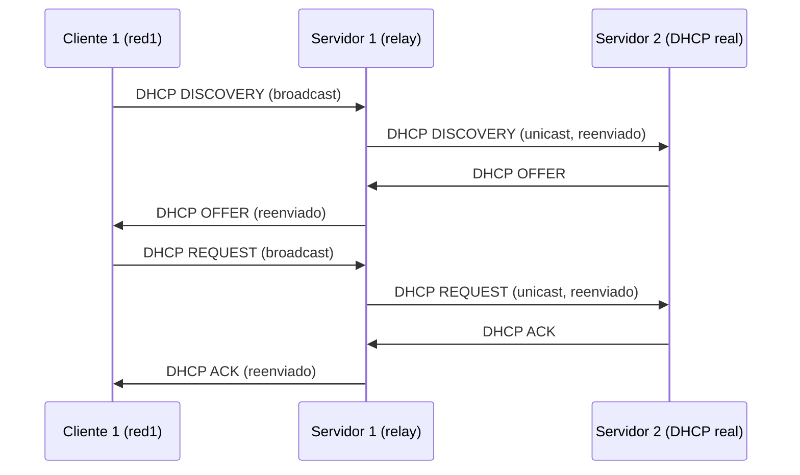

# UD01: Práctica DHCP 2

!!! abstract "Objetivo de la práctica"
    Comprobar en caliente el funcionamiento del servidor DHCP configurado en la Práctica 1, establecer rutas estáticas entre dos redes, y configurar un **agente DHCP Relay** para que los clientes de una red puedan recibir IP de un servidor DHCP situado en otra red.

    **Materiales:** VirtualBox · Debian sin entorno gráfico ×2 (servidores) · Debian con entorno gráfico ×2 (clientes) · `isc-dhcp-server` · `isc-dhcp-relay`

!!! warning "Práctica completamente local, sin tocar la red del centro"
    Como en la Práctica 1, no se usa ningún adaptador en modo puente. Esta vez, además, no hace falta trabajar por parejas: vas a montar **dos redes completas dentro de tu propio ordenador**, cada una con su servidor y su cliente, conectadas entre sí por una tercera red interna que simula el enlace entre ambas. Todo con redes internas de VirtualBox — ningún adaptador pide IP a la red real.

---

## 1. Prueba la configuración de DHCP

Antes de montar el escenario con dos redes, comprueba que el servidor de la Práctica 1 sigue respondiendo correctamente:

1. En el servidor, configura `dhcpd.conf` con un rango de `.3` a `.10` y reinicia el servicio para aplicar los cambios:
   ```bash
   sudo systemctl restart isc-dhcp-server
   ```
2. En el cliente, renueva la IP:
   ```bash
   sudo systemctl restart networking
   ```
3. Comprueba que le ha dado una IP dentro del rango correcto. Haz una captura.
4. Modifica el rango de IPs en el DHCP, poniendo de `.20` a `.30`.
5. En el cliente, vuelve a renovar la IP.
6. Comprueba que le ha dado una IP dentro del nuevo rango correcto. Haz una captura.

!!! warning "Los clientes con interfaz gráfica suelen usar NetworkManager, no ifupdown"
    Igual que en la Práctica 1: si `systemctl restart networking` no renueva nada en un cliente con entorno gráfico, usa `sudo dhclient -r && sudo dhclient`, o desconecta y reconecta el adaptador desde el icono de red del escritorio.

---

## 2. Monta las dos redes en tu propio ordenador

Vas a necesitar **4 máquinas virtuales** en total: dos redes completas (servidor + cliente cada una), conectadas por una red interna adicional que hace de "enlace entre redes" — sin usar nunca el modo puente.

| Máquina | Adaptador 1 | Adaptador 2 |
|---|---|---|
| Servidor 1 (Debian, sin interfaz gráfica) | Red interna **`red-central`** — `10.0.0.10` | Red interna **`red1`** — `172.1.1.1` |
| Cliente 1 (Debian, con interfaz gráfica) | Red interna **`red1`** — `172.1.1.2` (por DHCP) | — |
| Servidor 2 (Debian, sin interfaz gráfica) | Red interna **`red-central`** — `10.0.0.20` | Red interna **`red2`** — `172.1.6.1` |
| Cliente 2 (Debian, con interfaz gráfica) | Red interna **`red2`** — `172.1.6.2` (por DHCP) | — |


*Figura 1: dos redes independientes dentro de tu mismo ordenador, enlazadas por una tercera red interna (`red-central`) que hace de "cable" entre ambos servidores/router.*

!!! tip "Tres redes internas en VirtualBox"
    Necesitas crear tres redes internas distintas en VirtualBox (con nombres, por ejemplo, `red-central`, `red1` y `red2`) y asignar cada adaptador de cada VM a la que le corresponda según la tabla de arriba. Ninguna de las tres toca la red física del equipo ni la del centro.


*Captura: las 4 máquinas virtuales y sus adaptadores configurados en VirtualBox.*

---

## 3. Establece rutas para llegar al servidor de la otra red

Con la tabla del apartado anterior, cada servidor conoce su propia red (`172.1.1.0/24` o `172.1.6.0/24`) pero no la del otro servidor.

!!! question "Reflexiona antes de configurar nada"
    ¿A qué interfaz debe mandar el Servidor 1 el paquete para llegar a la red del Servidor 2, la `172.1.6.0/24`?

    ??? tip "Pista"
        El siguiente salto (*next hop*) es el Servidor 2, y a él solo se puede llegar por la interfaz que comparte red con él: `enp0s3` (la `10.0.0.0/24`, la `red-central`).

Añade la ruta estática correspondiente en cada servidor para poder llegar a la red del otro:

```bash
# En el Servidor 1, para llegar a la red del Servidor 2:
sudo ip route add 172.1.6.0/24 via 10.0.0.20 dev enp0s3

# En el Servidor 2, para llegar a la red del Servidor 1:
sudo ip route add 172.1.1.0/24 via 10.0.0.10 dev enp0s3
```

!!! tip "Recuerda"
    Esta ruta añadida con `ip route add` es temporal y se pierde al reiniciar. Si quieres que persista, añádela también en `/etc/network/interfaces` con una línea `post-up` dentro de la definición de `enp0s3`.


*Captura: salida de `ip route` en cada servidor, mostrando la ruta añadida hacia la red del otro.*

---

## 4. DHCP relay

Ahora vas a configurar el **Servidor 1** para que, en lugar de responder él mismo a las peticiones DHCP de su red, las **reenvíe** al servidor DHCP real, que va a ser el **Servidor 2**.

En el Servidor 1:

1. Instala el paquete `isc-dhcp-relay`:
   ```bash
   sudo apt update
   sudo apt install isc-dhcp-relay
   ```
2. Detén el servicio `isc-dhcp-server` en esta máquina, ya que ahora no va a responder él mismo, sino a reenviar las peticiones:
   ```bash
   sudo systemctl stop isc-dhcp-server
   ```
3. Durante la configuración del paquete (o editando `/etc/default/isc-dhcp-relay` después), indica:
   - **IP a la que redirigir las peticiones DHCP:** la IP del Servidor 2 en la `red-central`, es decir, `10.0.0.20`.
   - **Interfaz(es) por las que va a recibir peticiones DHCP de los clientes:** `enp0s8` (la interfaz de `red1`, donde está el Cliente 1).

!!! warning "El servidor DHCP real también necesita saber de la otra red"
    El **Servidor 2** (el que sí responde de verdad) debe tener configurado en su `dhcpd.conf` (la ruta ya la vimos en la Práctica 1) **tanto el rango de IP de su propia red (`172.1.6.0/24`) como el rango de IP de la red del Servidor 1 (`172.1.1.0/24`)**. Es decir, el `dhcpd.conf` debe tener declaradas dos `subnet`.

    No olvides aplicar los cambios:
    ```bash
    sudo systemctl restart isc-dhcp-server
    ```


*Figura 2: el Cliente 1 nunca habla directamente con el Servidor 2 — todo pasa por el Servidor 1 haciendo de relay.*


*Captura: archivo de configuración del relay con la IP del Servidor 2 y la interfaz de escucha.*


*Captura: `dhcpd.conf` del Servidor 2, con la `subnet` propia y la de la red del Servidor 1.*

---

## 5. Hagamos la prueba

Último paso: comprueba que todo funciona según lo diseñado.

- Desde el **Cliente 1**, solicita una IP nueva y comprueba que la recibe **del Servidor 2**, no de un servidor local en su propia red.
- Verifica en el **Servidor 2** que la concesión (*lease*) aparece asociada a un cliente de la red `172.1.1.0/24` (la del Servidor 1), no a la suya propia.

Haz las capturas necesarias para demostrarlo.

### Checklist de verificación

- [ ] El cliente recibe IP dentro del rango correcto tras el primer cambio de rango (`.3`–`.10`).
- [ ] El cliente recibe IP dentro del rango correcto tras el segundo cambio de rango (`.20`–`.30`).
- [ ] Las rutas estáticas entre ambas redes aparecen en `ip route` de los dos servidores.
- [ ] `isc-dhcp-relay` está instalado y configurado en el Servidor 1, con la IP del Servidor 2 y la interfaz de escucha correcta.
- [ ] El `dhcpd.conf` del Servidor 2 tiene declaradas las dos `subnet` (la suya y la del Servidor 1).
- [ ] El Cliente 1 recibe IP correctamente del Servidor 2 a través del relay.

---

## ¿Alguna duda?

Si el relay no reenvía las peticiones, revisa primero que el servicio `isc-dhcp-server` esté **detenido** en el Servidor 1 (no pueden convivir relay y servidor en el mismo host a la vez), que la interfaz indicada en `isc-dhcp-relay` sea `enp0s8`, y que la ruta hacia `10.0.0.20` exista en el Servidor 1.
