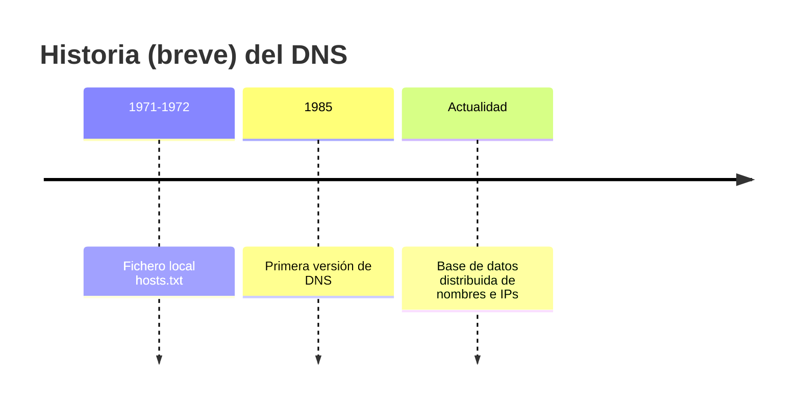
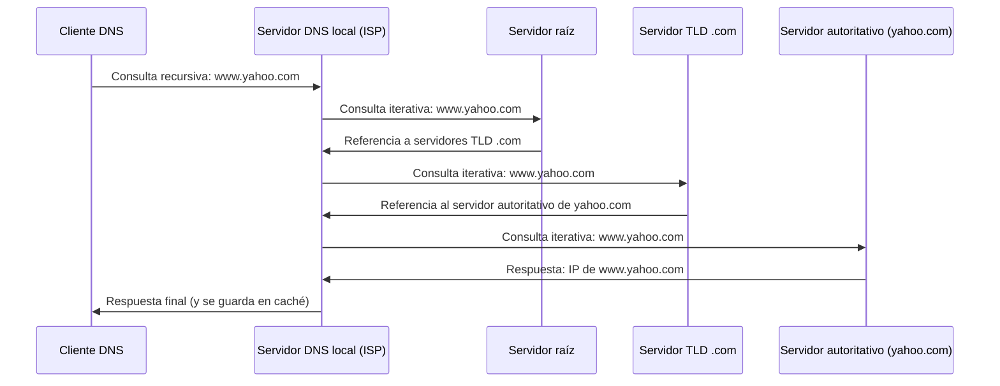

# UNIDAD 2: SERVICIO DNS

---

## 1. Introducción

- En una red TCP/IP los equipos se identifican mediante su dirección IP. Como usuarios nos resulta mucho más fácil recordar un nombre de dominio (`www.gva.es`) que una dirección IP (`193.144.127.85`).
- El servicio **DNS** proporciona el mecanismo de traducción entre nombres de dominio y direcciones IP.
- DNS no solo resuelve nombre → IP; también permite la **resolución inversa** (IP → nombre).
- Gracias a DNS, un dominio es independiente de su IP: puede cambiar de IP de forma transparente para el usuario, o incluso tener varias IPs a la vez (redundancia, balanceo de carga).

| | Nombres de dominio | Nombres de host | Hosts |
|---|---|---|---|
| Ejemplos | `.org` `.net` `google.com` | `pc1`, `a112`, `impresora1`… | Ordenadores, impresoras, routers, servidores… |
| Detalle | Jerarquía de dominios y subdominios | Nombre concreto de un equipo dentro de un dominio | Cada host tiene un nombre y al menos una IP |

---

## 2. Antes de que existiera DNS

- Entre 1971 y 1972 se usaba un fichero de texto local, `hosts.txt`, que asociaba manualmente IPs y nombres.
- Hoy en día, ese mismo mecanismo sigue existiendo como **archivo hosts**, aunque ya solo se usa para excepciones puntuales (no como sistema principal de resolución):

| Sistema | Ubicación del archivo `hosts` |
|---|---|
| Linux | `/etc/hosts` |
| Windows | `C:\Windows\System32\drivers\etc\hosts` |



### Comprobar qué servidores DNS tiene configurado un equipo

```bash
# Windows
ipconfig /all

# Linux
cat /etc/resolv.conf
```

---

## 3. Espacio de nombres de dominio

- DNS se apoya en una **base de datos distribuida**: la información no está en un único sitio, sino repartida entre miles de servidores DNS por todo el mundo.
- Esa base de datos se organiza como un **árbol invertido**: cada nombre de dominio es una rama, y cada nodo se separa del anterior con un punto (`.`).
- Cada etiqueta (*label*) de un nombre de dominio puede tener como máximo 63 caracteres, y no distingue mayúsculas de minúsculas (`www.serviciosenred.es` = `WWW.SERVICIOSENRED.ES`).

```mermaid
graph TD
    Root["\".\" — dominio raíz<br>(root servers)"]
    COM["com"]
    ES["es"]
    ORG["org"]
    Root --> COM
    Root --> ES
    Root --> ORG
    ES --> SER["serviciosenred.es"]
    SER --> WWW["www.serviciosenred.es"]
    SER --> FTP["ftp.serviciosenred.es"]
```
*Figura 1: jerarquía del espacio de nombres de dominio.*

### 3.1 Dominio raíz

- En teoría, todos los dominios acaban en un punto (`.`): el **dominio raíz**, un elemento nulo de 0 caracteres. En la práctica, ese punto final se omite porque los programas lo añaden por defecto.
- Un dominio se lee, formalmente, de derecha a izquierda, aunque en el uso diario lo hacemos de izquierda a derecha.
- El nombre que incluye ese punto final explícito se llama **FQDN** (*Fully Qualified Domain Name*, nombre de dominio totalmente cualificado). Ejemplos: `www.yahoo.com.`, `smtp.severoochoa.com.`

### 3.2 Dominios de primer nivel (TLD)

Los dominios que cuelgan directamente del dominio raíz se llaman **TLD** (*Top Level Domains*). Existen tres tipos:

| Tipo | Significado | Restricción | Ejemplos |
|---|---|---|---|
| **gTLD** | Genéricos | Cualquiera puede registrarlos | `.com`, `.net`, `.org` |
| **sTLD** | Patrocinados | Restringidos a una entidad concreta | `.gov`, `.edu`, `.cat` |
| **ccTLD** | Código de país | Asociados a una zona geográfica | `.es`, `.fr`, `.us` |

| TLD | Uso típico |
|---|---|
| `.com` | Organizaciones comerciales (`google.com`) |
| `.edu` | Organizaciones educativas |
| `.net` | Internet y telecomunicaciones |
| `.org` | Organizaciones sin ánimo de lucro |
| `.gov` | Organizaciones gubernamentales de EE. UU. |
| `.int` | Organizaciones internacionales |
| `.mobi` | Empresas o servicios de telefonía móvil |

El **ICANN** (*Internet Corporation for Assigned Names and Numbers*) es el organismo encargado de gestionar el dominio raíz y los TLD.

### 3.3 Dominios y subdominios

- `serviciosenred.es.` es un subdominio de `es.`, y `www.serviciosenred.es.` es a su vez un subdominio de `serviciosenred.es.`
- Los dominios que cuelgan del raíz son de primer nivel (TLD); los que cuelgan de un TLD son de segundo nivel, y así sucesivamente.

### 3.4 Delegación de dominios

- Al ser una base de datos distribuida, DNS permite una **administración descentralizada**: el administrador de un dominio puede dividirlo en subdominios y **delegar** el control de alguno de ellos a otra autoridad.
- Delegar no significa perder el control para siempre: el dominio padre puede retomar la autoridad delegada cuando quiera.
- La entidad que recibe la delegación asume también la responsabilidad de mantener actualizados los registros de ese subdominio.

---

## 4. Zonas

!!! note "Zona ≠ Dominio"
    Un **dominio** es un subárbol del espacio de nombres. Una **zona** es la porción de ese árbol cuyos datos están realmente almacenados en un servidor DNS concreto. Los datos de un mismo dominio pueden repartirse en varias zonas, en varios servidores distintos.

- El servidor de nombres que almacena la información de una zona se dice que tiene **autoridad** sobre ella.
- Una zona es, en la práctica, un archivo con una serie de registros de recursos (**RR**, *Resource Records*).
- Un mismo servidor DNS puede tener autoridad sobre varias zonas distintas (por ejemplo, `serviciosenred.es.` y `seguridadinformatica.es.` a la vez).

Ejemplo de fragmento de zona para `serviciosenred.es.`:

```dns
serviciosenred.es.        IN   NS      ns1.serviciosenred.es.
ns1.serviciosenred.es.    IN   A       192.168.1.20
andy.serviciosenred.es.   IN   A       192.168.1.21
lucas.serviciosenred.es.  IN   A       192.168.1.22
www.serviciosenred.es.    IN   CNAME   andy.serviciosenred.es.
ftp.serviciosenred.es.    IN   CNAME   lucas.serviciosenred.es.
```

Si de `serviciosenred.es.` cuelgan los subdominios `teoria.serviciosenred.es.` y `practicas.serviciosenred.es.`, y se decide delegar solo `practicas.serviciosenred.es.`, existirá **otro** servidor DNS autorizado para ese subdominio, con su propio archivo de zona.

### Ubicación de las zonas en Debian (bind9)

En Debian, usando `bind9` como servidor DNS, las zonas configuradas se declaran en:

```text
/etc/bind/named.conf.local
```

```text title="Ejemplo de declaración de zona"
zone "serviciosenred.es" {
    type master;
    file "/etc/bind/db.serviciosenred.es";
};
```

!!! warning "Comprueba la ruta real en tu sistema"
    Según la instalación, los archivos de zona pueden vivir en `/etc/bind/` (zonas maestras estáticas) o en `/var/cache/bind/` (zonas dinámicas o transferidas desde un maestro, que bind9 necesita poder escribir). Verifica siempre la ruta configurada en tu propio `named.conf.local` antes de dar por buena una ubicación.

---

## 5. Registros de recursos (RR)

Cada línea de un archivo de zona es un **registro de recursos** (*Resource Record*, RR). Los RR se envían en las preguntas y respuestas entre clientes y servidores DNS, y tienen este formato general:

```text
Propietario   TTL   Clase   Tipo   RDATA
```

| Campo | Significado |
|---|---|
| **Propietario** | Nombre de máquina o dominio al que pertenece el recurso. `@` representa el nombre de la zona. |
| **TTL** (*Time To Live*) | Segundos que el RR puede permanecer en caché antes de descartarse. Opcional: puede fijarse un TTL global para toda la zona. |
| **Clase** | Familia de protocolos. Casi siempre `IN` (Internet, TCP/IP). |
| **Tipo** | El tipo de registro (ver tabla siguiente). |
| **RDATA** | Datos específicos de ese tipo (p. ej., la IP en un registro `A`). |

### 5.1 Tipos de RR

| Registro | Nombre | Función |
|---|---|---|
| **SOA** | Start Of Authority | Identifica al servidor autoritativo de la zona y sus parámetros de configuración. Solo puede haber uno por zona. |
| **NS** | Name Server | Identifica los servidores de nombres autorizados para una zona. |
| **A** | Address | Asocia un FQDN con una dirección IPv4. |
| **AAAA** | Address (IPv6) | Asocia un FQDN con una dirección IPv6. |
| **CNAME** | Canonical Name | Define un alias hacia otro nombre ya definido en un registro `A`/`AAAA`. |
| **MX** | Mail Exchanger | Indica los servidores de correo del dominio, y su prioridad. |
| **PTR** | Pointer | Asocia una IP con un nombre de dominio. Se usa en resolución inversa. |
| **TXT** | Text | Almacena texto arbitrario asociado a un dominio. |
| **SRV** | Service | Asocia nombres con servidores y puertos de servicios concretos (SIP, LDAP, XMPP…). |

#### Registro SOA

Especifica información autoritativa sobre la zona: servidor maestro, contacto del administrador, número de serie y varios temporizadores.

| Campo | Significado |
|---|---|
| **MNAME** | FQDN del servidor DNS maestro del dominio. |
| **Contacto** | Correo del administrador (con el `@` sustituido por un `.`). |
| **Serial** | Versión del fichero de zona; se incrementa en cada cambio. Formato habitual: `aaaammdd` + 2-3 dígitos (ej. `20190425001`). |
| **Refresh** | Cada cuánto pregunta un esclavo al maestro si hay cambios. |
| **Retry** | Si falla la transferencia, cuánto espera el esclavo para reintentarlo. |
| **Expire** | Tiempo máximo que un esclavo sigue respondiendo sin contactar con el maestro antes de declararse no autorizado. |
| **TTL negativo** | Tiempo mínimo que se cachean las respuestas negativas. |

```dns
serviciosenred.es.   IN   SOA   ns1.serviciosenred.es. super.serviciosenred.es. (
                              20190425001   ; serial
                              604800        ; refresh (7 días)
                              86400         ; retry (1 día)
                              2419200       ; expire (28 días)
                              604800 )      ; TTL negativo (7 días)
```

#### Registro NS

```dns
serviciosenred.es.   IN   NS   ns1.serviciosenred.es.   ; maestro
serviciosenred.es.   IN   NS   ns2.serviciosenred.es.   ; esclavo

ns1.serviciosenred.es.   IN   A   192.168.10.20
ns2.serviciosenred.es.   IN   A   192.168.10.21

practicas.serviciosenred.es.   IN   NS   ns1.practicas.serviciosenred.es.
```

#### Registros A / AAAA

```dns
ns1.serviciosenred.es.    IN   A      192.168.10.20
andy.serviciosenred.es.   IN   A      192.168.10.22
andy.serviciosenred.es.   IN   AAAA   2001:0db8:0000:0000:0000:8a2e:0370:7334
```

#### Registro CNAME

```dns
andy.serviciosenred.es.   IN   A       192.168.1.22
www.serviciosenred.es.    IN   CNAME   andy.serviciosenred.es.
ftp.serviciosenred.es.    IN   CNAME   andy.serviciosenred.es.
```

!!! warning "CNAME no se usa a la derecha de un MX o un NS"
    Un registro CNAME puede apuntar a otro dominio (`www.serviciosenred.es. IN CNAME www.serviciosenred.com.`), pero la parte derecha de un `MX` o un `NS` siempre debe ser un nombre definido con `A`/`AAAA`, nunca un `CNAME`.

#### Registro MX

```dns
serviciosenred.es.        IN   MX   10   mail1.serviciosenred.es.
serviciosenred.es.        IN   MX   20   mail2.serviciosenred.es.

mail1.serviciosenred.es.  IN   A    192.168.1.100
mail2.serviciosenred.es.  IN   A    192.168.1.101
```

A menor número de preferencia, mayor prioridad: `mail1` se intentará antes que `mail2`. Si hay varios registros con la misma preferencia, se prueban todos antes de pasar al siguiente.

#### Registro PTR (resolución inversa)

```dns
20.1.168.192.in-addr.arpa.   IN   PTR   ns1.serviciosenred.es.
21.1.168.192.in-addr.arpa.   IN   PTR   ns2.serviciosenred.es.
22.1.168.192.in-addr.arpa.   IN   PTR   andy.serviciosenred.es.
```

#### Registro TXT

Permite asociar texto arbitrario a un dominio (hasta 255 caracteres por cadena). Se usa como documentación o para verificar la propiedad de un dominio ante un proveedor:

```dns
serviciosenred.es.   IN   TXT   "google-site-verification=rXOxyZounnZasA8Z7oaD3c14JdjS9aKSWvsR1EbUSIQ"
```

> Existen muchos más tipos de registro. Listado completo: [es.wikipedia.org/wiki/Anexo:Tipos_de_registros_DNS](https://es.wikipedia.org/wiki/Anexo:Tipos_de_registros_DNS)

---

## 6. Tipos de servidor DNS

| Tipo | Qué hace |
|---|---|
| **Maestro / primario** | Tiene los archivos de zona en lectura-escritura. El administrador edita aquí. |
| **Esclavo / secundario** | Obtiene sus archivos de zona del maestro mediante *transferencia de zona*. Son de solo lectura. |
| **Caché** | No tiene autoridad sobre ninguna zona; solo pregunta a otros servidores y guarda las respuestas en caché. |
| **Forwarder (reenviador)** | Reenvía las consultas que no puede resolver a otro servidor DNS designado, en vez de hacer la búsqueda iterativa él mismo. |
| **Solo autorizado (*auth only*)** | Responde solo sobre sus propias zonas: no tiene recursividad activada, no reenvía ni actúa como caché. |
| **Raíz (*root server*)** | Conoce los servidores autorizados de cada TLD. Existen 13, replicados mundialmente mediante *anycasting*; se nombran `letra.root-servers.net` (A a M). |

!!! tip "Un servidor puede combinar varios roles"
    Un mismo servidor DNS puede ser maestro para una zona y esclavo para otra a la vez. Tener varios esclavos para una misma zona, repartidos en redes y ubicaciones distintas, mejora la tolerancia a fallos, reparte la carga y acelera las respuestas.

### Configuraciones típicas en una red

- **Mismo dominio:** los servidores DNS de la red pertenecen al mismo dominio que el equipo cliente.
- **ISP:** los servidores DNS son los de tu proveedor de Internet.
- **Solo caché:** los servidores DNS configurados son únicamente una caché, sin autoridad sobre ningún dominio propio.

---

## 7. Proceso de resolución DNS

### 7.1 Consultas recursivas vs. iterativas

| | Consulta recursiva | Consulta iterativa |
|---|---|---|
| **Quién hace el trabajo** | El servidor consultado se encarga de seguir la cadena hasta resolver el nombre (o determinar que no existe). | El servidor da la mejor respuesta que tiene; si no la conoce, indica a qué otro servidor preguntar. |
| **Quién pregunta a quién** | El cliente solo habla con su servidor DNS local; este habla con el resto. | El propio servidor (o cliente) va preguntando servidor a servidor. |
| **Tipos de respuesta** | Positiva / Negativa / Error | Positiva / Negativa / Referencia (a otro servidor) / Error |

En la práctica: el cliente lanza una consulta **recursiva** a su servidor DNS local (normalmente el del ISP), y ese servidor local hace **consultas iterativas** en cadena (root → TLD → autoritativo) hasta obtener la respuesta.

### 7.2 Ejemplo completo: resolución de `www.yahoo.com.`


*Figura 2: el cliente solo habla con su servidor DNS local; el resto de la cadena la recorre el propio servidor local mediante consultas iterativas.*

- Si el cliente ya tiene la respuesta en su propia caché, el proceso ni siquiera empieza.
- El servidor DNS local guarda en caché tanto la respuesta final como las direcciones de los servidores intermedios que ha ido consultando, para acelerar futuras resoluciones.

### 7.3 Roles en la cadena de resolución

| Rol | Función |
|---|---|
| **Cliente DNS** | Mantiene su propia caché para acelerar resoluciones repetidas. |
| **Servidor DNS local** | Recibe la consulta del cliente; mira en su caché o inicia una búsqueda recursiva. |
| **Servidores raíz y TLD** | Dan información sobre qué servidor es autoritativo, sin resolver ellos mismos el nombre completo. |
| **Servidor autoritativo** | Da la respuesta final: la IP del dominio consultado. |

---

## 8. Resolución inversa

- Consiste en obtener el nombre de dominio a partir de una dirección IP, en vez de al revés.
- Las direcciones IP se tratan como nombres que cuelgan de un dominio especial: **`.arpa`** (*Address and Routing Parameter Area*), un TLD genérico reservado para la infraestructura de Internet.
  - `in-addr.arpa` para IPv4.
  - `ip6.arpa` para IPv6.
- Al mapear una IP, se invierte el orden de los octetos. Por ejemplo, `192.168.1.21` se mapea como `21.1.168.192.in-addr.arpa`.

Ejemplo de zona de resolución inversa para la red `192.168.1.0/24`:

```dns
1.168.192.in-addr.arpa.      IN   NS    ns1.serviciosenred.es.
20.1.168.192.in-addr.arpa.   IN   PTR   ns1.serviciosenred.es.
21.1.168.192.in-addr.arpa.   IN   PTR   andy.serviciosenred.es.
22.1.168.192.in-addr.arpa.   IN   PTR   lucas.serviciosenred.es.
```

!!! note "Las zonas directa e inversa son independientes"
    No es obligatorio que quien administra la zona directa de un dominio administre también su zona inversa correspondiente. Son responsabilidades distintas, y es cosa de los administradores mantenerlas coherentes entre sí.

El proceso de resolución inversa sigue la misma lógica que el directo (consultas recursivas, iterativas, caché, TTL…), solo que preguntando por una IP en vez de por un nombre.

---

## 9. Responsabilidad sobre el sistema DNS

| Organismo | Función |
|---|---|
| **ICANN** (*Internet Corporation for Assigned Names and Numbers*) | Organización sin ánimo de lucro. Asigna direcciones IP e identificadores de protocolo, gestiona el sistema de nombres de dominio y administra los servidores raíz. Acredita a los *registrars* (registradores de dominios). |
| **IANA** (*Internet Assigned Numbers Authority*) | Mantiene y publica las zonas de los servidores raíz, asigna el espacio de nombres a los RIR (registradores regionales) y supervisa las operaciones sobre root servers y TLD. |
| **Registradores (*registrars*)** | Acreditados por ICANN. Gestionan altas, bajas y modificaciones de los servidores de autoridad de los dominios que registran. |
| **Operadores de servidores raíz** | 12 operadores gestionan los 13 servidores raíz (múltiples copias distribuidas mediante *anycast*). Más información: [root-servers.org](https://root-servers.org/) |

---

## 10. Herramientas de diagnóstico

### `nslookup`

Programa para consultar servidores DNS: comprobar que un nombre se resuelve correctamente, diagnosticar problemas de configuración, o consultar directamente registros de recursos. Disponible tanto en Linux/Unix como en Windows.

```bash
# Modo no interactivo
nslookup www.serviciosenred.es

# Modo interactivo
nslookup
> server 8.8.8.8
> www.serviciosenred.es
> exit
```

### `dig`

Herramienta más flexible y detallada para consultar servidores DNS, muy usada para depurar problemas gracias a la claridad de su salida. También disponible en Linux/Unix y Windows.

```bash
dig www.serviciosenred.es
dig www.serviciosenred.es MX
dig -x 192.168.1.21          # resolución inversa
```

---

## 11. Configuración básica de un servidor DNS en Debian (bind9)

1. Instala el paquete `bind9`:
   ```bash
   sudo apt update
   sudo apt install bind9 bind9utils dnsutils
   ```
2. Declara tu zona en `/etc/bind/named.conf.local`:
   ```text
   zone "serviciosenred.es" {
       type master;
       file "/etc/bind/db.serviciosenred.es";
   };
   ```
3. Crea el archivo de zona (puedes partir de la plantilla `/etc/bind/db.local`) con tus registros `SOA`, `NS`, `A`, `CNAME`, etc.
4. Si vas a resolver también en modo inverso, declara además la zona `in-addr.arpa` correspondiente.
5. Comprueba la sintaxis y reinicia el servicio:
   ```bash
   sudo named-checkzone serviciosenred.es /etc/bind/db.serviciosenred.es
   sudo systemctl restart bind9
   sudo systemctl status bind9
   ```

!!! tip "Verifica siempre con dig o nslookup contra tu propio servidor"
    ```bash
    dig @127.0.0.1 www.serviciosenred.es
    ```
    Apuntar la consulta contra `127.0.0.1` (o la IP de tu propio servidor) te asegura que estás probando tu configuración, y no la respuesta cacheada de otro DNS.

---

## ¿Alguna duda?
