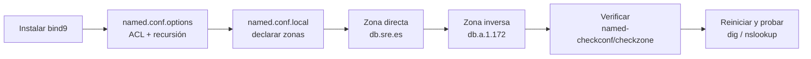

# UD02: Práctica DNS 1

!!! abstract "Objetivo de la práctica"
    Instalar y configurar un servidor DNS con **bind9** en Debian, capaz de resolver de forma directa e inversa los nombres de tu red interna (`sre.es`), reutilizando la misma topología de red que en las prácticas de DHCP (UD01).

    **Materiales:** el servidor Debian (sin interfaz gráfica) de las prácticas de DHCP · `bind9`

!!! note "Reutilizamos la topología de UD01"
    Esta práctica se apoya en la misma máquina servidor (Debian, sin interfaz gráfica) y la misma red interna `172.1.a.0/24` que configuraste para DHCP. Si no la tienes ya montada, repasa primero la Práctica 1 de DHCP.



---

## 1. Instalación del servidor DNS

**Bind** es el estándar de facto para servidores DNS: software libre, disponible en la mayoría de plataformas Unix/Linux, donde también se le conoce como `named` (*name daemon*). **Bind9** es la versión recomendada, y la que usaremos.

```bash
sudo apt update
sudo apt install bind9 bind9-utils bind9-doc
```

!!! note "Nombre del paquete de utilidades"
    En instalaciones antiguas puede llamarse `bind9utils` (sin guion); en Debian actual el nombre correcto es `bind9-utils`. Si `bind9-utils` no se encuentra, prueba con `bind9utils`.

---

## 2. Forzar solo IPv4

Como en clase solo trabajamos con IPv4, se lo indicamos a Bind en su archivo general de configuración, ubicado en `/etc/default/named`. Hay que modificar la línea siguiente:

```text title="/etc/default/named" hl_lines="1"
OPTIONS="-u bind -4"
```

El archivo de configuración principal de Bind (`named.conf`) está en `/etc/bind`.

---

## 3. Estructura de la configuración

Si consultamos `/etc/bind/named.conf`, veremos lo siguiente:

```text title="/etc/bind/named.conf"
// This is the primary configuration file for the BIND DNS server named.
//
// Please read /usr/share/doc/bind9/README.Debian.gz for information on the
// structure of BIND configuration files in Debian, *BEFORE* you customize
// this configuration file.
//
// If you are just adding zones, please do that in /etc/bind/named.conf.local

include "/etc/bind/named.conf.options";
include "/etc/bind/named.conf.local";
include "/etc/bind/named.conf.default-zones";
```

Este fichero solo aglutina otros tres archivos de configuración, ubicados en el mismo directorio, donde realizaremos la configuración real:

| Archivo | Para qué sirve |
|---|---|
| `named.conf.options` | Comportamiento general del servidor: recursión, quién puede consultar, en qué IP escucha... |
| `named.conf.local` | Declaración de las zonas de las que este servidor es responsable. |
| `named.conf.default-zones` | Zonas por defecto (localhost, etc.). No la tocaremos. |

---

## 4. Configuración de `named.conf.options`

Antes de tocar nada, haz siempre una copia de seguridad:

```bash
sudo cp /etc/bind/named.conf.options /etc/bind/named.conf.options.backup
```

Edita `named.conf.options` e incluye lo siguiente:

### 4.1 Lista de acceso (ACL)

Por seguridad, vamos a incluir una lista de acceso para que solo puedan hacer consultas recursivas al servidor los hosts que nosotros decidamos: los de nuestra red interna, `172.1.a.0/24`. Esto se añade **justo antes** del bloque `options {...}`, al principio del archivo:

```text hl_lines="2"
# Lista de acceso para permitir únicamente los hosts que decidamos
acl confiables {
    172.1.a.0/24;
};
```

### 4.2 Opciones dentro de `options { ... }`

Dentro del bloque `options {...}` que ya trae el archivo por defecto, hay que:

- Permitir consultas recursivas **solo** a los hosts de la ACL `confiables`.
- No permitir transferencia de zona a nadie, de momento.
- Escuchar en el puerto 53 (el que usa DNS) en la IP de la interfaz de la red privada del servidor (`172.1.a.1`).
- Activar la recursión (ya limitada por la ACL del primer punto).
- Comentar la línea `listen-on-v6 { any; };`, ya que no vamos a responder consultas IPv6.

```text title="/etc/bind/named.conf.options (fragmento)" hl_lines="2 8 9 10 11 16"
options {
    directory "/var/cache/bind";

    // If there is a firewall between you and nameservers you want
    // to talk to, you might need to fix the firewall to allow multiple
    // ports to talk. See http://www.kb.cert.org/vuls/id/800113

    // forwarders {
    //     0.0.0.0;
    // };

    allow-recursion { confiables; };
    allow-transfer { none; };
    listen-on port 53 { 172.1.a.1; };
    recursion yes;

    //========================================================================
    // If BIND logs error messages about the root key being expired,
    // you will need to update your keys. See https://www.isc.org/bind-keys
    //========================================================================
    dnssec-validation auto;

    // listen-on-v6 { any; };
};
```

!!! tip "El directorio de caché"
    El servidor ya viene configurado por defecto como caché DNS. El directorio donde se guardan las zonas cacheadas es `/var/cache/bind`.

### 4.3 Comprobar la sintaxis

```bash
sudo named-checkconf
```

Si no devuelve ningún mensaje, la sintaxis es correcta.

### 4.4 Aplicar los cambios

```bash
sudo systemctl restart named
sudo systemctl status named
```

---

## 5. Declaración de la zona directa

En `/etc/bind/named.conf.local` declaramos nuestras zonas. Vamos a declarar la zona `sre.es`, indicando que este servidor es **maestro** para ella y dónde estará el archivo de zona:

```text title="/etc/bind/named.conf.local"
zone "sre.es" {
    type master;
    file "/etc/bind/db.sre.es";
};
```

---

## 6. Creación del archivo de zona directa

Creamos el archivo de zona en la ruta y con el nombre que acabamos de indicar (`/etc/bind/db.sre.es`). Respeta el formato exactamente:

```dns title="/etc/bind/db.sre.es" hl_lines="9 10 11 12"
;
;   BIND data file for sre.es
;
$TTL    604800
@       IN      SOA     dnsserver.sre.es. admin.sre.es. (
                              2         ; Serial
                         604800         ; Refresh
                          86400         ; Retry
                        2419200         ; Expire
                         604800 )       ; Negative Cache TTL
;
@           IN      NS      dnsserver.sre.es.
dnsserver   IN      A       172.1.a.1
clidebian   IN      A       172.1.a.2
alu1        IN      A       172.1.a.5
juan        IN      CNAME   alu1.sre.es.
```

- **SOA:** parámetros de la zona autoritativa (serial, tiempos de refresco, etc. — ya los vimos en la UD02 de teoría).
- **NS:** indica que `dnsserver` es el servidor de nombres de la zona.
- **A:** direcciones IP de `dnsserver` (el propio servidor) y `clidebian` (el cliente de tus prácticas de DHCP).
- **CNAME:** `juan` como alias de `alu1`, a modo de ejemplo.

!!! warning "Cada vez que edites la zona, incrementa el `Serial`"
    El número de serie debe subir en cada modificación del archivo de zona, o los servidores esclavos no detectarán el cambio (lo veremos en la Práctica 2).

---

## 7. Declaración y creación de la zona inversa

Recuerda que hacen falta **dos** archivos de zona: uno para la resolución directa (ya hecho) y otro para la inversa.

### 7.1 Declarar la zona inversa

Añade estas líneas a `named.conf.local`, igual que hicimos con la zona directa. La zona inversa de una red `172.1.a.0/24` se nombra invirtiendo sus tres primeros octetos:

```text title="/etc/bind/named.conf.local (añadido)"
zone "a.1.172.in-addr.arpa" {
    type master;
    file "/etc/bind/db.a.1.172";
};
```

> Sustituye `a` por el tercer byte real de tu red interna (el mismo que usaste en DHCP).

### 7.2 Crear el archivo de zona inversa

```dns title="/etc/bind/db.a.1.172"
;
;   BIND reverse data file for 172.1.a.0/24
;
$TTL    604800
@       IN      SOA     dnsserver.sre.es. admin.sre.es. (
                              2         ; Serial
                         604800         ; Refresh
                          86400         ; Retry
                        2419200         ; Expire
                         604800 )       ; Negative Cache TTL
;
@   IN      NS      dnsserver.sre.es.
1   IN      PTR     dnsserver.sre.es.
2   IN      PTR     clidebian.sre.es.
5   IN      PTR     alu1.sre.es.
```

---

## 8. Comprobar y aplicar

Comprueba la sintaxis de cada zona por separado (la sintaxis correcta es `named-checkzone <nombre_zona> <archivo>`, no dos archivos seguidos):

```bash
sudo named-checkzone sre.es /etc/bind/db.sre.es
sudo named-checkzone a.1.172.in-addr.arpa /etc/bind/db.a.1.172
```

Reinicia el servicio y comprueba el estado:

```bash
sudo systemctl restart named
sudo systemctl status named
```

En el registro de arranque deberías ver algo como `all zones loaded` y `running`, sin errores.

---

## 9. Comprobación de las resoluciones

Desde el cliente, prueba los dominios con `ping` y con `nslookup`:

```bash
ping dnsserver.sre.es
ping clidebian.sre.es

nslookup dnsserver.sre.es
nslookup clidebian.sre.es
nslookup 172.1.a.1        # resolución inversa
```

!!! tip "Configura el cliente para usar tu servidor DNS"
    Asegúrate de que el cliente tiene `172.1.a.1` (tu servidor) como servidor DNS — bien recibido por DHCP (`option domain-name-servers 172.1.a.1;` en el `dhcpd.conf` de UD01), bien configurado manualmente para esta prueba.

### Checklist de verificación

- [ ] `named-checkconf` y `named-checkzone` no muestran errores.
- [ ] `systemctl status named` muestra `active (running)`.
- [ ] `ping dnsserver.sre.es` y `ping clidebian.sre.es` resuelven la IP correcta.
- [ ] `nslookup` resuelve tanto de forma directa como inversa (IP → nombre).

---

## ¿Alguna duda?
