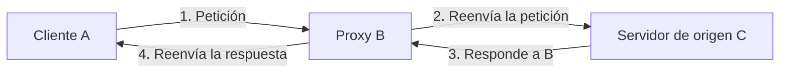
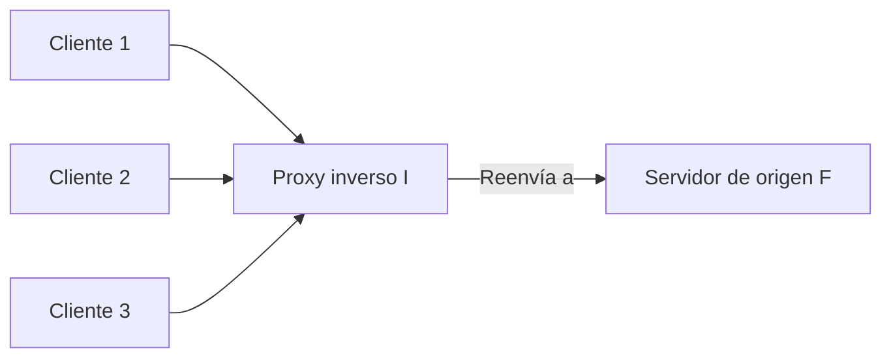

# UD03: Práctica 5 — Proxy directo, proxy inverso y balanceo de carga

!!! abstract "Objetivo de la práctica"
    Entender la diferencia entre un proxy directo y uno inverso, y configurar Apache como proxy inverso, tanto redirigiendo a un único servidor como balanceando carga entre varios.

    **Materiales:** el servidor Debian con Apache (UD03-Práctica1)

---

## 1. ¿Qué es un servidor proxy?

Un **proxy de reenvío** (*forward proxy*), a menudo llamado simplemente "proxy", es un servidor que se sitúa delante de un grupo de máquinas cliente. Cuando esas máquinas piden algo en Internet, el proxy intercepta la petición y se comunica él mismo con el servidor web de destino, en nombre del cliente — actúa de intermediario.

Tres máquinas típicas en esta comunicación:

- **A:** el ordenador de un usuario.
- **B:** el servidor proxy de reenvío.
- **C:** el servidor de origen de un sitio web.



En una comunicación normal, A hablaría directamente con C. Con un proxy de reenvío, A siempre habla con B, y es B quien habla con C.

### ¿Por qué usar un proxy de reenvío?

- **Sortear restricciones de navegación**, estatales o institucionales: en vez de conectar directamente a los sitios bloqueados, el cliente se conecta al proxy.
- **Bloquear el acceso a cierto contenido**: al revés, una red puede obligar a pasar por un proxy que filtra ciertos sitios (por ejemplo, redes sociales en una red escolar).
- **Proteger la identidad**: la IP que ve el servidor de destino es la del proxy, no la del cliente real.

---

## 2. ¿En qué se diferencia un proxy inverso?

Es el caso contrario: un **proxy inverso** (*reverse proxy*) se sitúa delante de uno o varios servidores web, interceptando las peticiones de los clientes.

- **Proxy de reenvío:** se sitúa delante del cliente. Ningún servidor de origen habla nunca directamente con ese cliente.
- **Proxy inverso:** se sitúa delante del servidor de origen. Ningún cliente habla nunca directamente con ese servidor.



Normalmente todas las peticiones de los clientes (D) irían directas al servidor (F). Con un proxy inverso, todas van primero al proxy (I), que las reenvía a F y devuelve la respuesta a cada cliente.

### Beneficios de un proxy inverso

| Beneficio | En qué consiste |
|---|---|
| **Balanceo de carga** | Reparte el tráfico entre varios servidores de origen, para que ninguno se sature. Si uno falla, los demás pueden asumir su carga. |
| **Protección contra ataques** | El sitio nunca revela la IP real de sus servidores de origen, dificultando ataques dirigidos (como DDoS). |
| **Caché** | Puede guardar contenido en caché, sirviendo respuestas más rápido. |
| **Cifrado SSL/TLS** | Puede encargarse él mismo de cifrar/descifrar el tráfico, liberando esa carga de cómputo al servidor de origen. |

---

## 3. Tarea 1: proxy inverso simple

Tienes 2 IPs en tu servidor. Vas a usar una IP para un *Virtual Host* que reciba la petición, y esta la redirigirá al otro *Virtual Host*.

Activa los módulos necesarios:

```bash
sudo a2enmod proxy proxy_html proxy_http
sudo systemctl restart apache2
```

Configura tu *Virtual Host* con una directiva de proxy. Un ejemplo para redirigir del puerto 80 al 8080, en el *Virtual Host* que recibe las peticiones por el puerto 80:

```apache
<VirtualHost *:80>
    ProxyPreserveHost On
    ProxyAddHeaders On
    ProxyPass / http://127.0.0.1:8080/ connectiontimeout=5 timeout=30
    ProxyPassReverse / http://127.0.0.1:8080/
</VirtualHost>
```

- `ProxyPass`: define hacia dónde se reenvía la petición.
- `ProxyPassReverse`: reescribe las cabeceras de la respuesta (como `Location`) para que el cliente no vea la URL interna real.
- `ProxyPreserveHost`: conserva la cabecera `Host` original del cliente al reenviar la petición.

Reinicia Apache y comprueba, desde el cliente, que al acceder por el puerto 80 recibes en realidad el contenido del *Virtual Host* del puerto 8080.

### Checklist

- [ ] Módulos `proxy`, `proxy_html` y `proxy_http` activos.
- [ ] El *Virtual Host* del puerto 80 redirige correctamente al del 8080 (compruébalo con una captura y con `curl -v`).

---

## 4. Tarea 2: balanceo de carga

Ahora vas a balancear el tráfico entre **2 Virtual Host**. Necesitas los módulos `proxy_balancer` y `lbmethod_byrequests`:

```bash
sudo a2enmod proxy_balancer lbmethod_byrequests
sudo systemctl restart apache2
```

Ejemplo de configuración:

```apache
<Proxy "balancer://myset">
    BalancerMember "http://www2.example.com:8080" loadfactor=1
    BalancerMember "http://www3.example.com:8080" loadfactor=2
</Proxy>

ProxyPass "/" "balancer://myset/"
ProxyPassReverse "/" "balancer://myset/"
```

- Cada `BalancerMember` es un servidor de destino entre los que se reparte el tráfico.
- `loadfactor` pondera cuánto tráfico recibe cada uno: en el ejemplo, `www3` recibirá el doble de peticiones que `www2`.

Adáptalo a tu topología (por ejemplo, tus 4 *Virtual Host* de la Práctica 2, o dos servidores distintos si los tienes disponibles) y comprueba, haciendo varias peticiones seguidas, que las respuestas van alternando entre los servidores del grupo.

!!! tip "Cómo comprobar que reparte carga de verdad"
    Sirve, en cada `BalancerMember`, un `index.html` distinto que identifique claramente cuál es. Haz varias peticiones seguidas con `curl` y observa cómo cambia la respuesta.

### Checklist

- [ ] Módulos `proxy_balancer` y `lbmethod_byrequests` activos.
- [ ] Grupo `balancer://` configurado con al menos 2 miembros.
- [ ] Comprobación de que el tráfico se reparte entre ambos (capturas de varias peticiones consecutivas).

---

## ¿Alguna duda?
