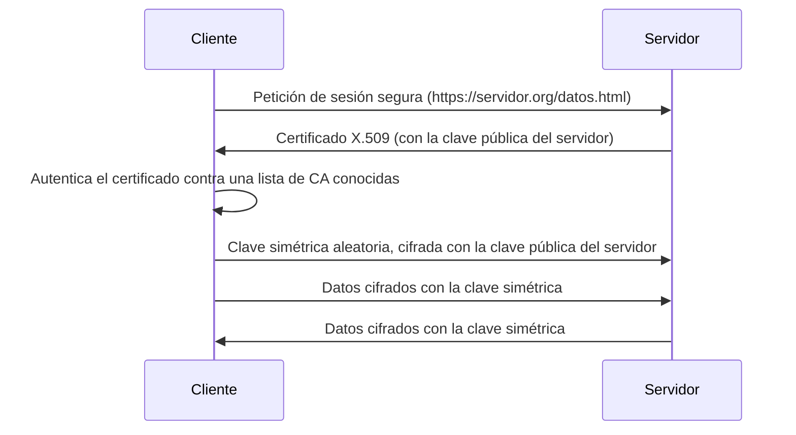

# UNIDAD 3: SERVICIO WEB

---

## 1. Introducción

- El acceso global a Internet ha impulsado la creación y publicación de páginas web para empresas y usuarios particulares.
- Las páginas web (HTML, imágenes, vídeos, código...) deben alojarse en servidores web con suficiente espacio y buena conexión.
- Es esencial garantizar la seguridad mediante protocolos como HTTPS.
- Los servidores web deben manejar cargas variables, ya que las peticiones pueden aumentar repentinamente, y las páginas con más interacción o cifrado consumen más recursos.

---

## 2. Servicio web

- Un servidor web almacena contenido y lo mantiene disponible de forma constante y segura.
- Cuando visitas una página, es un servidor web el que envía sus componentes (HTML, imágenes, CSS...) a tu navegador.
- Toda página accesible en Internet necesita un servidor para sus contenidos. Las grandes empresas suelen tener servidores propios; la mayoría de administradores usan centros de datos de proveedores de alojamiento.

### Tecnología de los servidores web

- El software del servidor HTTP entrega los datos necesarios para que el navegador muestre la página.
- Al introducir una URL, el navegador envía una solicitud y el servidor responde con el contenido. Las páginas pueden ser **estáticas** o **dinámicas** (generadas con PHP, Java...).
- La comunicación usa HTTP o HTTPS, sobre TCP/IP, permitiendo atender múltiples usuarios a la vez.
- El rendimiento depende del hardware, el número de solicitudes y la complejidad del contenido. Un fallo técnico o un corte eléctrico puede provocar periodos de inactividad (*downtime*).

### Otras funcionalidades de los servidores web

Además de servir contenido, la mayoría de servidores web ofrecen:

| Funcionalidad | Para qué sirve |
|---|---|
| **Seguridad** | Cifrado de la comunicación cliente-servidor vía HTTPS. |
| **Autenticación** | Restringir el acceso a ciertas áreas de la web. |
| **Redirección** | Redirigir una solicitud mediante un *rewrite engine*. |
| **Caché** | Guardar contenido dinámico ya generado, para responder más rápido y aliviar la carga del servidor. |
| **Cookies** | Envío y procesado de cookies HTTP. |

---

## 3. El protocolo HTTP

- **HTTP** (*Hypertext Transfer Protocol*) es el protocolo usado en cada transacción de la World Wide Web.
- Define la sintaxis y semántica que usan clientes, servidores y proxies para comunicarse.
- Es un protocolo orientado a conexión, con esquema **petición → respuesta**.

### Breve historia

| Versión | Novedad principal |
|---|---|
| **HTTP/0.9** (1991) | Una sola línea, solo método `GET`, solo HTML. Sin cabeceras ni códigos de error. |
| **HTTP/1.0** (1996) | Aparecen las **cabeceras** (permiten enviar cualquier tipo de archivo, no solo HTML) y el **código de estado** al inicio de la respuesta. |
| **HTTP/1.1** (1997) | Conexiones reutilizables, *pipelining*, negociación de contenido, y la cabecera `Host` (permite alojar varios dominios en una misma IP — la base de los *Virtual Host*). |
| **HTTP/2** (2015) | Protocolo binario y **multiplexado** (varias peticiones en paralelo sobre la misma conexión), compresión de cabeceras. |
| **HTTP/3** (2020) | Deja de usar TCP y pasa a **UDP**, mediante el protocolo **QUIC**, para evitar la espera de confirmación paquete a paquete. |

---

## 4. Funcionamiento de HTTP

1. El usuario accede a una URL (enlace o escrita directamente).
2. El navegador la descompone: protocolo, dirección del servidor (DNS o IP), puerto (80 por defecto) y recurso solicitado. Ej.: `http://direccion[:puerto][/ruta]`
3. Se abre una conexión TCP/IP con el servidor, en el puerto correspondiente, y se envía la petición HTTP.
4. El servidor responde con un código de estado, el tipo de dato (MIME) y el propio contenido.
5. Se cierra la conexión. Si el documento tiene recursos incrustados (imágenes, vídeos...), el proceso se repite una vez por cada uno.

### Métodos HTTP

| Método | Para qué sirve |
|---|---|
| `GET` | Solicitar cualquier recurso (el más habitual: enlaces, URLs escritas a mano). |
| `HEAD` | Como `GET`, pero solo pide metadatos (tamaño, tipo, fecha...), sin el cuerpo. Usado por cachés y proxies. |
| `POST` | Enviar información al servidor (p. ej., los datos de un formulario). |
| `PUT` | El inverso de `GET`: escribe/crea/reemplaza un recurso en la URL indicada. |
| `DELETE` | Elimina el recurso indicado. |
| `OPTIONS` | Devuelve qué métodos soporta el servidor para una URL. |
| `TRACE` | Sondeo de los dispositivos por los que pasa la petición. |

### Petición y respuesta

```text title="Ejemplo de petición HTTP"
POST / HTTP/1.1
Host: localhost:8000
User-Agent: Mozilla/5.0 (Macintosh; …) Firefox/51.0
Accept: text/html,application/xhtml+xml,…,*/*;q=0.8
Accept-Language: en-US,en;q=0.5
Accept-Encoding: gzip, deflate
Connection: keep-alive
Content-Type: multipart/form-data; boundary=-12656974
Content-Length: 345

-12656974
(más datos del formulario)
```

```text title="Ejemplo de respuesta HTTP"
HTTP/1.1 403 Forbidden
Server: Apache
Content-Type: text/html; charset=iso-8859-1
Date: Wed, 10 Aug 2016 09:23:25 GMT
Connection: Keep-Alive
Content-Length: 220

<!DOCTYPE HTML PUBLIC "-//IETF//DTD HTML 2.0//EN">
(cuerpo de la respuesta)
```

Una petición se compone del **método + recurso + versión**, unas **cabeceras** opcionales, y opcionalmente un **cuerpo** (separado de las cabeceras por una línea en blanco). Una respuesta se compone de una **línea de estado**, sus **cabeceras**, y el **cuerpo** con el recurso solicitado.

### Códigos de estado

Se identifican con 3 cifras, agrupadas por su primer dígito:

| Rango | Significado |
|---|---|
| **1XX** | Informativo |
| **2XX** | Éxito |
| **3XX** | Redirección |
| **4XX** | Error del cliente |
| **5XX** | Error del servidor |

### Cabeceras HTTP

Parámetros enviados en una petición o respuesta para aportar información adicional sobre la transacción, con la sintaxis `Cabecera: Valor`. Las envía automáticamente el navegador o el servidor.

### Tipos MIME

Estándar (*Multipurpose Internet Mail Extensions*) que identifica el tipo de contenido de un archivo, con el formato:

```text
[tipo]/[árbol.][subtipo][+sufijo][;parámetros]
```

Ejemplos: `image/png`, `application/rss+xml`, `video/mp4;codecs="avc1.640028"`, `application/vnd.google-earth.kmz`

---

## 5. HTTPS

- **HTTPS** (*Hypertext Transfer Protocol Secure*) es HTTP sobre una capa de cifrado: la versión segura del protocolo.
- Originalmente usaba **SSL**; hoy en día SSL está obsoleto y se usa **TLS** (*Transport Layer Security*), aunque "SSL" se sigue usando coloquialmente para referirse a TLS.


*Figura 1: negociación simplificada de una sesión HTTPS (TLS handshake).*

!!! note "¿Y la autenticación Digest?"
    Además de HTTPS, HTTP define un mecanismo llamado **autenticación Digest**, pensado para no enviar la contraseña en claro cuando la conexión no está cifrada (a diferencia de la autenticación **Basic**, que sí la envía, solo codificada en Base64 — no cifrada). Hoy en día, con HTTPS generalizado, la conexión entera ya va cifrada, así que Basic sobre HTTPS es igual de seguro y mucho más simple de configurar. Por eso Digest ha caído en desuso y en esta unidad solo trabajaremos con autenticación **Basic**.

---

## 6. Apache vs Nginx

- Para montar un servidor web hace falta un sistema operativo (normalmente Linux), un gestor de bases de datos (MySQL...) y, si hay contenido dinámico, un lenguaje como PHP.
- **Apache** y **Nginx** dominan juntos más del 85% del mercado de servidores web.

| | Apache | Nginx |
|---|---|---|
| **Punto fuerte** | Flexible y fácil de configurar | Alto rendimiento con mucho tráfico concurrente |
| **Consumo de RAM** | Mayor | Ligero |
| **Funciones extra** | Módulos muy variados (mod_php, mod_ssl...) | Destaca como *proxy* inverso y balanceador de carga |
| **Uso típico hoy** | Contenido dinámico, configuración por directorio (`.htaccess`) | Contenido estático, *proxy* delante de otro servidor, alta concurrencia |

Ambos pueden convivir: es habitual usar Nginx como *proxy* inverso delante de Apache, sirviendo él el contenido estático y dejando que Apache procese el contenido dinámico.

!!! tip "En las prácticas de esta unidad usamos Apache"
    Por ser el más extendido para empezar y el más sencillo de configurar por directorio. La lógica de *Virtual Host*, HTTPS o *proxy* que aprenderás aquí se traslada de forma directa a Nginx si en el futuro necesitas usarlo.

---

## ¿Alguna duda?
